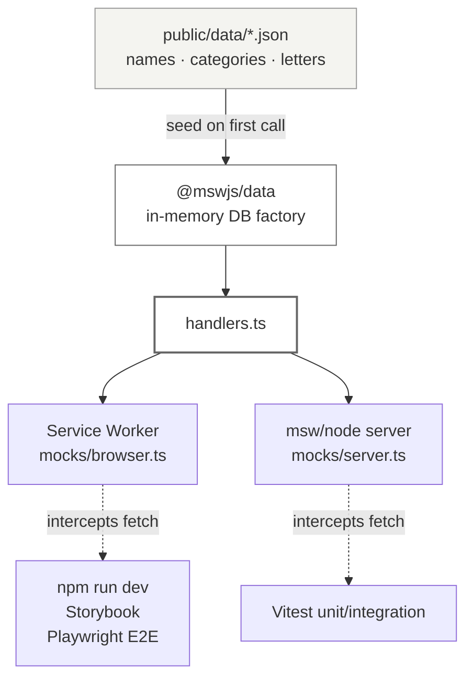
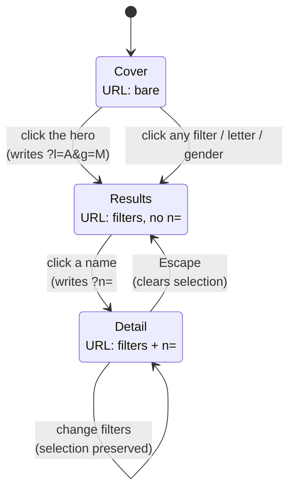

# Dog Name Generator

A single-page app for browsing 679 pet names. Filter by gender, letter, or category. Every view is a shareable URL. There's no backend; MSW intercepts `/api/*` in the browser.

Implements the Pet Name Finder take-home; the task brief lives in `React_FED_Test_Task.md`.

## Built with

- **Framework:** React, TypeScript, Vite
- **State:** Zustand (client state), TanStack Query (server state), React Router (URL sync)
- **UI:** Tailwind CSS, class-variance-authority, Framer Motion, Radix UI, react-virtuoso
- **Mocking:** MSW with `@mswjs/data` (browser SW + Node server)
- **Testing:** Vitest, React Testing Library, Playwright, Storybook
- **Tooling:** ESLint, Prettier, Husky, lint-staged

## Setup

```bash
npm install
npm run dev              # http://localhost:3000
npm run e2e:install      # one-time: download Chromium for Playwright
```

## Commands

```
npm run dev              Vite dev server + browser SW mocking
npm run build            tsc --noEmit && vite build
npm run preview          Serve the built artifact
npm run typecheck        tsc --noEmit
npm run lint             eslint src
npm run format           prettier --write .
npm run test             vitest                (watch mode)
npm run test:ci          vitest run            (one-shot, CI + pre-push)
npm run test:ui          vitest --ui
npm run test:coverage    vitest run --coverage
npm run e2e              playwright test       (webServer block boots npm run dev)
npm run e2e:ui           playwright test --ui
npm run storybook        Storybook dev on :6006
npm run build-storybook  Static Storybook build (CI smoke test)
```

## Architecture

**One feature, bulletproof-react layout.** All the browse code lives under `src/features/browse/`, covering API hooks, components, store, utils, and types. Shared primitives sit one level up. ESLint's `import/no-restricted-paths` stops the shared layer from reaching back into features.

**Mocks work in two runtimes from one file.** `handlers.ts` serves both the browser Service Worker (for `npm run dev`, Storybook, and Playwright) and the Node `msw/node` server (for Vitest). They share a single `@mswjs/data` in-memory DB seeded from `public/data/*.json`. `main.tsx` blocks the React root on `enableMocking()` so no `useQuery` ever fires before MSW is ready.



**The URL is the source of truth.** Every filter lives in query params (`?g=&l=&mc=&rc=&n=&p=`): gender, letter, macro and raw categories, selected name, page. Zustand mutations push to the URL on every change. On boot the store hydrates from the URL, falling back to defaults. Because the URL is canonical, "Copy link" is a plain `window.location.href`.

**Navigation is a three-state machine.** The URL also decides which content layout renders. No filter and no selection → Cover (hero photo and "I NEED A NAME"). Any filter but no selection → Results (papillon beside a depth-of-field name stack, chevrons on the right). Selection resolves to a real name → Detail (master + right pane, chevrons on the left). A `useBrowseState()` hook derives the state from the URL-backed store and hands `BrowseLayout` one branch to render.



**List performance: virtualized and paginated one-way.** `react-virtuoso` renders only the visible rows out of 679, so scroll and filter transitions stay cheap. Chevrons call `scrollToIndex`; `page` is derived from Virtuoso's `rangeChanged` callback, not written back into it. Keyboard scroll, wheel scroll, and chevron clicks all flow through the same path. Hydration seeds `initialTopMostItemIndex` on first mount so no post-mount effect races the first `rangeChanged`.

**`BASE_URL` on every URL.** SW registration, `/api/*` fetches, and any static-asset `src` all derive from `import.meta.env.BASE_URL`. That makes the GitHub Pages subpath deploy work with zero retrofit. `fetch('/api/names')` would break on Pages; ``fetch(`${import.meta.env.BASE_URL}api/names`)`` doesn't.

**Zustand Sets need new references.** `macroCategories` and `rawCategories` are `Set`s, and Zustand compares by reference. Store actions construct a new `Set(state.xs)` before mutating, so subscribers re-render. In-place `.add()` changes the contents but not the reference, so nothing would update.

## Testing

- **Unit + integration** via Vitest + RTL + MSW node. 172 tests across 24 files. Run `npm run test:ci`.
- **E2E** via Playwright (chromium + mobile-chromium projects). 6 specs in `e2e/`: cover, browse, filter, share, mobile, results. Run `npm run e2e`. The `webServer` block boots `npm run dev` on port 3000 and lets the browser SW intercept `/api/*` exactly the way a real user hits it. No fixtures, no reset endpoint; every test starts with `page.goto('/')`.
- **Storybook**, about 50 stories across 16 files. Run `npm run storybook`. `msw-storybook-addon` wires the same SW into every story so hooks resolve against the seeded DB.

## Accessibility

- `<nav>` and `<main>` landmarks wrap the filter chrome and main content.
- The gender band is a `role="radiogroup"`; the letter strip is a `role="tablist"` with roving tabindex. Arrow keys move between options; Home and End jump to the first and last enabled tab.
- Focus moves to the detail heading when a name is selected. Escape clears the selection and restores focus to the originating list item.
- ArrowDown and ArrowUp move focus within the name list; Enter opens the detail.
- All motion is gated on `prefers-reduced-motion: reduce`: cover fades, list transitions, chevron hover scale, and the mobile bottom sheet all flatten to zero duration when requested.
- Color contrast: red on cream is reserved for large text (the 45px selected name, the 25px letter on a filled red circle). Body text is `#3A3533` on cream, which clears AA.

## Assumptions

A few calls we made because the task brief or the provided data didn't settle them outright.

- **Macro-category mapping.** The task gives 7 top-level dropdowns and 25 raw categories but no mapping between them. `macro-category-map.ts` is our best semantic guess; anything unmapped falls through to "Others".

- **Ñ in the letter strip.** Figma shows Ñ between N and O. `letters.json` doesn't include it, and the dataset has zero Ñ-initial names. We followed the API. A provided data contract outranks a Figma reference that disagrees with itself, so Ñ is dropped.

- **Three-state navigation.** The three Figma frames (`frame-cover`, `frame-results`, `frame-detail`) read as sequential states, not alternatives. Cover shows with no filters set. Results is when a filter is active but no name is clicked: dog photo next to a depth-of-field name stack, no description panel. Detail opens when a name is clicked. Clicking anywhere past the hero applies `?l=A&g=M` (the Figma-literal defaults shown in `frame-cover.png`) and transitions to Results.

- **Category dropdowns as a horizontal strip.** `frame-detail-filter-open.png` shows the open dropdown as a full-width strip below the filter bar, not a floating menu anchored to the trigger. We took that literally. Triggers carry a red dot when their macro has active selections so you can still see what's filtering when its strip is closed.

- **Gender glyph in the detail row.** ♂ for pure-male names, ♀ for pure-female, ♂♀ for multi-gender or Marley (the one name with empty `gender: []`). Marley also matches _both_ filters, never excluded.

- **HTML in `definition`** is stripped to plain text. Swap to `dompurify` if rich formatting ever matters.

- **Dog photos.** Cover uses the Figma reference (Getty stock); Results uses a second papillon, also from Figma. Replace both with CC-0 assets before any public deploy.

## Omitted by design

- **Dark mode, text search, favorites, auth, i18n, real backend.** Not in the Figma or the task brief.
- **Visual regression** (Chromatic/Percy), **cross-browser E2E** (Firefox, WebKit), and **a11y auditing** via `axe-playwright`. Each is its own rabbit hole; chromium + mobile chromium is enough signal for this scope.
- **React Hook Form.** Bulletproof-react ships it, but filters have no submit step, so live Zustand-backed inputs are simpler.
- **Standalone Express mock server** (bulletproof-react's default). The app is read-only, so the browser SW covers both dev and E2E on its own.

## Deployment

This is a pure client-side SPA. Production has no real backend. MSW stays enabled at build time (`VITE_APP_ENABLE_API_MOCKING=true`) and the Service Worker intercepts `/api/*` exactly the way it does in dev. The `dist/` build artifact is the entire deliverable; any static host can serve it.

GitHub Pages is the intended target. `BASE_URL` discipline is baked into SW registration and every fetch, so `DEPLOY_TARGET=github-pages` + `VITE_APP_ENABLE_API_MOCKING=true` produces a bundle that serves correctly from a repo subpath. The Pages workflow lands in a follow-up once the repo is pushed to GitHub.
