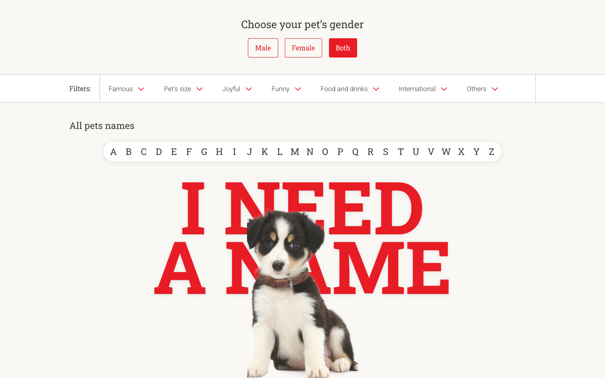
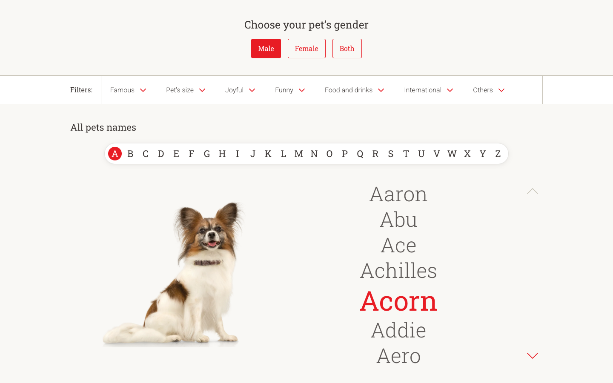
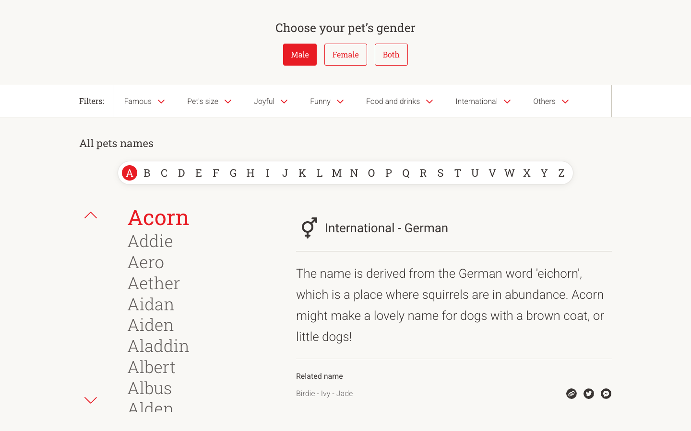
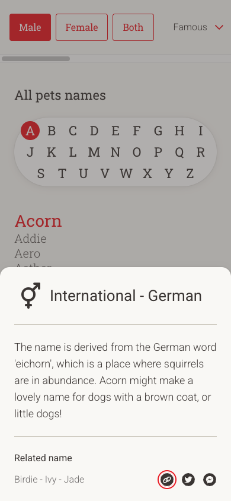
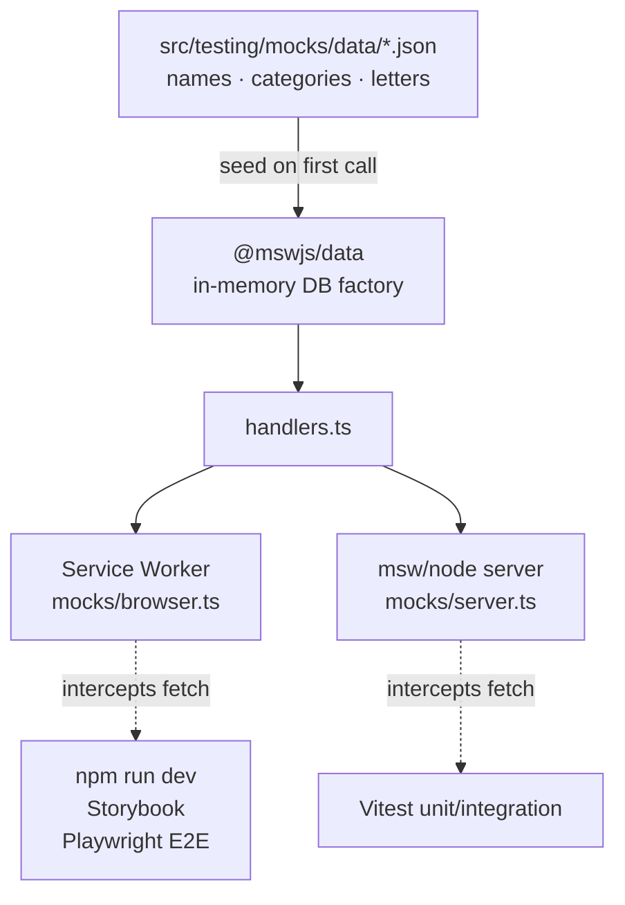
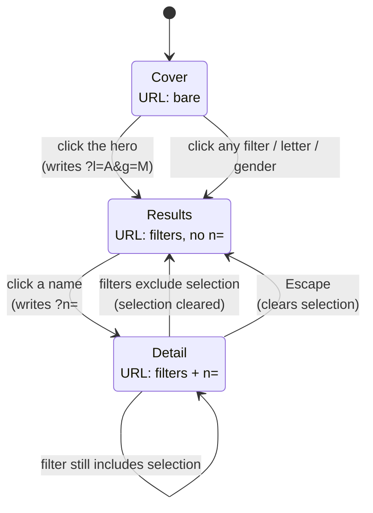

# Dog Name Generator

A single-page app for browsing 679 pet names. Filter by gender, letter, or category. Every view is a shareable URL. There's no backend; MSW intercepts `/api/*` in the browser.

**Live demo:** https://spencerjireh.github.io/react-fed-test-task/

## Screenshots

| Cover                                                          | Results                                                                  |
| -------------------------------------------------------------- | ------------------------------------------------------------------------ |
|  |  |

| Detail                                                                                       | Mobile detail                                                   |
| -------------------------------------------------------------------------------------------- | --------------------------------------------------------------- |
|  |  |

## Built with

- **Framework:** React, TypeScript, Vite
- **State:** Zustand (client state), TanStack Query (server state), React Router (URL sync)
- **UI:** Tailwind CSS, class-variance-authority, Framer Motion, Radix UI, react-virtuoso
- **Mocking:** MSW with `@mswjs/data` (browser SW + Node server)
- **Testing:** Vitest, React Testing Library, Playwright, Storybook
- **Tooling:** ESLint, Prettier, Husky, lint-staged

## Setup

```bash
cp .env.example .env     # flips on MSW for local dev
npm install
npm run dev              # http://localhost:3000
npm run e2e:install      # one-time: download Chromium for Playwright
```

## Commands

```
npm run dev              Vite dev server + browser SW mocking
npm run build            tsc --noEmit && vite build
npm run preview          Serve the built artifact
npm run typecheck        tsc --noEmit
npm run test             vitest                (watch mode — local dev)
npm run test:ci          vitest run            (one-shot, CI + pre-push)
npm run test:ui          vitest --ui
npm run test:coverage    vitest run --coverage
npm run e2e              playwright test       (webServer block boots npm run dev)
npm run e2e:ui           playwright test --ui
npm run storybook        Storybook dev on :6006
npm run build-storybook  Static Storybook build (CI smoke test)
```

## Architecture

**One feature, bulletproof-react layout.** All the browse code lives under `src/features/browse/`, covering API hooks, components, store, utils, and types. Shared primitives sit one level up. ESLint's `import/no-restricted-paths` stops the shared layer from reaching back into features.

**Mocks work in two runtimes from one file.** `handlers.ts` serves both the browser Service Worker (for `npm run dev`, Storybook, and Playwright) and the Node `msw/node` server (for Vitest). They share a single `@mswjs/data` in-memory DB seeded from `src/testing/mocks/data/*.json`. `main.tsx` blocks the React root on `enableMocking()` so no `useQuery` ever fires before MSW is ready.



**The URL is the source of truth.** Every filter lives in query params (`?g=&l=&mc=&rc=&n=`): gender, letter, macro and raw categories, selected name. Zustand mutations push to the URL on every change. On boot the store hydrates from the URL, falling back to defaults. Because the URL is canonical, "Copy link" is a plain `window.location.href`.

**Navigation is a three-state machine.** The URL also decides which content layout renders. No filter and no selection → Cover (hero photo and "I NEED A NAME"). Any filter but no selection → Results (papillon beside a depth-of-field name stack, chevrons on the right). Selection resolves to a real name → Detail (master + right pane, chevrons on the left). A `useBrowseState()` hook derives the state from the URL-backed store and hands `BrowseLayout` one branch to render.



**List performance: virtualized and paginated one-way.** `react-virtuoso` renders only the visible rows out of 679, so scroll and filter transitions stay cheap. Chevrons read the last visible range from a ref and call `scrollToIndex` to advance by the visible row count. Keyboard scroll, wheel scroll, and chevron clicks all flow through the same path. Hydration seeds `initialTopMostItemIndex` on first mount so no post-mount effect races the first `rangeChanged`.

## Testing

- **Unit + integration** via Vitest + RTL + MSW node. Run `npm run test:ci`.
- **E2E** via Playwright (chromium + mobile-chromium projects). Specs in `e2e/` cover the cover, browse, filter, share, mobile, and results flows. Run `npm run e2e`. The `webServer` block boots `npm run dev` on port 3000 and the browser SW intercepts `/api/*` exactly the way a real user hits it. No fixtures, no reset endpoint — every test starts with `page.goto(...)`.
- **Storybook** stories sit beside their components. Run `npm run storybook`. `msw-storybook-addon` wires the same SW into every story, so hooks resolve against the seeded DB.

## Accessibility

- `<nav>` and `<main>` landmarks wrap the filter chrome and main content.
- The gender band is a `role="radiogroup"`; the letter strip is a `role="tablist"` with roving tabindex. Arrow keys move between options; Home and End jump to the first and last enabled tab.
- Escape clears the selection and restores focus to the originating list item.
- ArrowDown and ArrowUp move focus within the name list; Enter opens the detail.
- All motion is gated on `prefers-reduced-motion: reduce`: cover fades, list transitions, chevron hover scale, and the mobile bottom sheet all flatten to zero duration when requested.
- Color contrast: red on cream is reserved for large text (the 45px selected name, the 25px letter on a filled red circle). Body text is `#3A3533` on cream, which clears AA.

## Assumptions

A few calls made because the task brief or provided data didn't settle them outright.

- **Macro-category mapping.** The brief gives 7 top-level dropdowns and 25 raw categories but no mapping between them. `macro-category-map.ts` is a best semantic guess; anything unmapped falls through to "Others".
- **Ñ in the letter strip.** Figma shows Ñ between N and O. `letters.json` doesn't include it, and the dataset has zero Ñ-initial names, so the API wins and Ñ is dropped.
- **A Results view between Cover and Detail.** The brief only shows Cover and Detail, but filtering from the cover hands the user a list before they pick a name; this middle state is why `?l=A&g=M` without `n=` renders a full-pane list rather than auto-selecting.

## Out of scope

No dark mode, text search, favorites, auth, i18n, or real backend — none were in the brief. No Firefox/WebKit E2E, visual regression, or `axe-playwright` either; chromium + mobile chromium is enough signal for this project.

## Deployment

Pure client-side SPA, deployed to GitHub Pages by the `deploy` job in `.github/workflows/ci.yml` on every push to `main`. MSW stays enabled in production (`VITE_APP_ENABLE_API_MOCKING=true`), and the Service Worker intercepts `/api/*` the same way it does in dev — the `dist/` build is the entire deliverable. `BASE_URL` discipline is baked into SW registration and every fetch, so the repo-subpath URL serves correctly with no retrofit. `fetch('/api/names')` would break on Pages; ``fetch(`${import.meta.env.BASE_URL}api/names`)`` doesn't.
