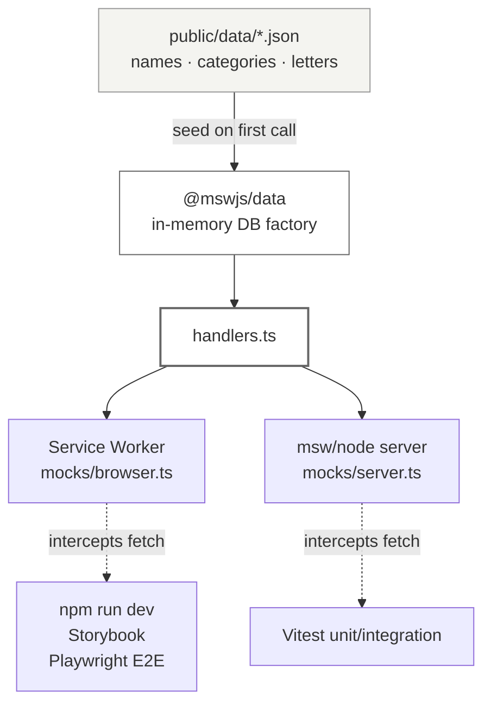

# Dog Name Generator

A single-page master-detail browser for 679 pet names, filterable by gender,
letter, and category, with URL-shareable state. Read-only app fronted by
MSW (Mock Service Worker) — no real backend.

## Setup

```bash
npm install
npm run dev              # http://localhost:3000
npm run e2e:install      # one-time: download Chromium for Playwright
```

## Commands

```
npm run dev              Vite dev server + browser SW mocking
npm run build            tsc --noEmit && vite build
npm run preview          Serve the built artifact
npm run typecheck        tsc --noEmit
npm run lint             eslint src
npm run format           prettier --write .
npm run test             vitest                (watch mode)
npm run test:ci          vitest run            (one-shot — CI + pre-push)
npm run test:ui          vitest --ui
npm run test:coverage    vitest run --coverage
npm run e2e              playwright test       (webServer block boots npm run dev)
npm run e2e:ui           playwright test --ui
npm run storybook        Storybook dev on :6006
npm run build-storybook  Static Storybook build (CI smoke test)
```

## Architecture

**Single feature, bulletproof-react layout.** All name-browsing code lives
under `src/features/browse/` — API hooks, components, store, hooks, utils,
types. Shared UI primitives, error fallbacks, and config live one level up.
ESLint's `import/no-restricted-paths` enforces that `components`/`hooks`/
`lib` cannot reach into `features`/`app`.

**MSW two-runtime, one handler file.** `src/testing/mocks/handlers.ts` feeds
both the browser Service Worker (`browser.ts` — dev, Storybook, Playwright
E2E against the real dev server) and the Node server (`server.ts` — Vitest).
Both query the same `@mswjs/data` in-memory DB seeded once from
`public/data/*.json`. `src/main.tsx` blocks `createRoot` on
`enableMocking()` so the first `useQuery` always sees an intercepted
response.



**URL is the source of truth.** All filter state (gender, letter, macro +
raw categories, selected name id, page) serializes into short query params
(`?g=&l=&mc=&rc=&n=&p=`). Every Zustand mutation pushes to the URL with
`navigate(..., { replace: true })` and mirrors to `localStorage`. On boot,
the store hydrates URL > localStorage > defaults. The share feature is a
pure `window.location.href` copy.

**One-way data flow for chevron pagination.** `react-virtuoso` renders the
list; chevrons call `scrollToIndex`; `page` state is _derived_ from
Virtuoso's `rangeChanged` callback. Chevrons never call `setPage` directly.
Hydration seeds `initialTopMostItemIndex` on first mount to avoid a
post-mount effect racing the first `rangeChanged`. Wheel and keyboard
scroll flow through the same path — one source of truth, no desync.

**BASE_URL for every URL.** The SW registration URL, all `fetch()` URLs
for `/api/*`, and any static-asset `src` derive from
`import.meta.env.BASE_URL` so the GitHub Pages subpath deploy works
without retrofit. `fetch('/api/names')` breaks on Pages;
`fetch(\`${import.meta.env.BASE_URL}api/names\`)` works everywhere.

**Zustand Sets need new references.** `macroCategories` / `rawCategories`
are `Set`s. Zustand compares by reference, so store actions construct a
new `Set(state.xs)` before mutating it — in-place `.add()` changes
contents but not the ref, so subscribed components wouldn't re-render.

## Testing

- **Unit + integration** (Vitest + RTL + MSW node): 152 tests across 22 files.
  Run `npm run test:ci`.
- **E2E** (Playwright, chromium + mobile-chromium projects): 5 specs under
  `e2e/` — cover, browse, filter, share, mobile bottom sheet. Run
  `npm run e2e`. Playwright's `webServer` block boots `npm run dev` on
  port 3000; MSW's browser Service Worker intercepts `/api/*` the same way
  it does for users. No fixtures, no `/__reset` endpoint — every test calls
  `page.goto('/')` for a fresh SW + reseeded DB.
- **Storybook** (~50 stories across ~16 files): `npm run storybook`.
  `msw-storybook-addon` wires the browser SW into each story so
  `useNames()` / `useCategories()` resolve against the seeded DB.

## Assumptions

1. **Macro-category mapping is inferred**, not authoritative (the task
   provides 7 top-level dropdowns but 25 raw categories). The mapping in
   `src/features/browse/utils/macro-category-map.ts` is a best semantic
   guess; any raw category not in the map falls through to "Others".
2. **Ñ in the letter strip** is a Spanish-language artifact from the
   Figma. The data has no names starting with Ñ, so it renders disabled.
   The implementation handles Ñ-names automatically if data ever adds them.
3. **The one name with empty `gender: []`** (Marley) is treated as
   matching _both_ genders — it's never excluded by a gender filter.
4. **HTML in `definition`** is stripped for plain-text rendering. Swap to
   a sanitized-HTML render via `dompurify` if rich formatting is needed.
5. **Cover V1 hero asset** is the Figma reference image (Getty stock).
   Ship replaces this with a Creative Commons-licensed dog placeholder
   before any public deploy.

## Omitted by design

- **Dark mode, text search, favorites, authentication, i18n, backend** —
  not in Figma or task brief.
- **Visual regression** (Chromatic/Percy), **cross-browser E2E** (Firefox,
  WebKit), **a11y auditing** via `axe-playwright` — each is its own
  decision; chromium + mobile chromium is sufficient signal for this
  scope.
- **`React Hook Form`** — bulletproof-react ships it, but filters have no
  submit step so live Zustand-backed inputs are simpler.
- **Standalone Express mock server** (from bulletproof-react) — the app
  is read-only, so the browser SW covers both dev and E2E.

## Deployment

The app is a pure client-side SPA. Production has **no real backend**;
MSW stays enabled (`VITE_APP_ENABLE_API_MOCKING=true` at build time) and
the Service Worker intercepts `/api/*` the same way it does in dev. The
build artifact (`dist/`) is the deliverable any static host can consume.

GitHub Pages is the intended target. `BASE_URL` discipline is baked into
SW registration and every fetch URL, so building with
`DEPLOY_TARGET=github-pages` + `VITE_APP_ENABLE_API_MOCKING=true` produces
a bundle that serves correctly from a repo subpath. The Pages workflow
lands in a follow-up once the repo is on GitHub.
